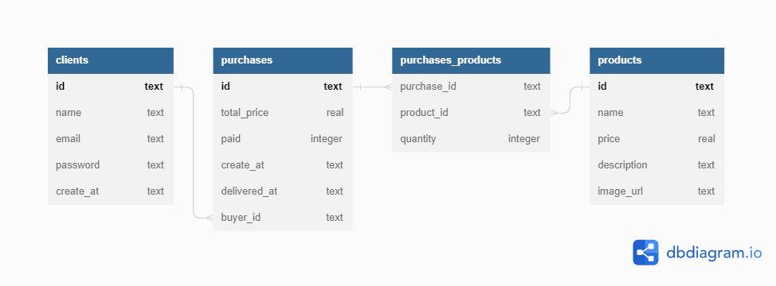

#LABECOMMERCE

## 📖 Introdução

Projeto 'Labecommerce' é uma API para armazenar todas as informações de um e-commerce na base de dados.

Você terá acesso as informações de Produtos, Cliente e Compra relacionadas entre si.

Para acessar a documentação, [aqui!](https://documenter.getpostman.com/view/24460616/2s8ZDU6QRE)!

## 📄 Descrição

### Instalando as dependências:
- npm install: Instala todas as dependências listadas no package.json;
- npm i cors: biblioteca para liberar acesso externo ao servido;
- npm i express : framework para criar o servidor (API);
- npm i knex: biblioteca query builder para conectar com banco de dados
- npm i sqlite3: biblioteca do banco de dados SQLite

### Executando o projeto
- npm run dev: Estabelece a conexão com o banco de dados e reinicia automaticamente o servidor localhost toda a vez que o projeto for alterado e salvo.

### Endpoints
- Ping: Endpoint de teste da API;
- GetAll clients: Retorna todas as pessoas cadastradas;
- Create client: Cadastra um novo cliente.
- Create product: Cadastra um novo produto.
- Get all products '1': Retorna todos os produtos cadastrados.
- Get all products '2': Caso seja enviada uma query params (q) deve ser retornado o resultado da busca de produtos por nome.
- Edit product by id: Edita um produto existente.
- Create Purchase: Cadastra um novo pedido.
- Delete purchase by id: Deleta um pedido existente.
- Get purchase by id: Retorna os dados de uma compra, incluindo a lista de produtos da mesma.

## 💻 Tecnologias 

### Programas utilizados:
- Postman API Platform
- VSCode

## 📫 Contato

E-mail: emidio.daniel@hotmail.com

